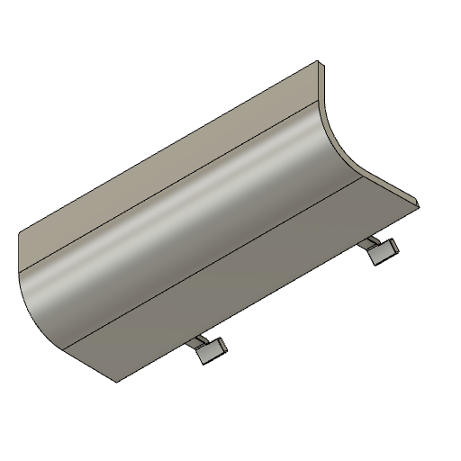
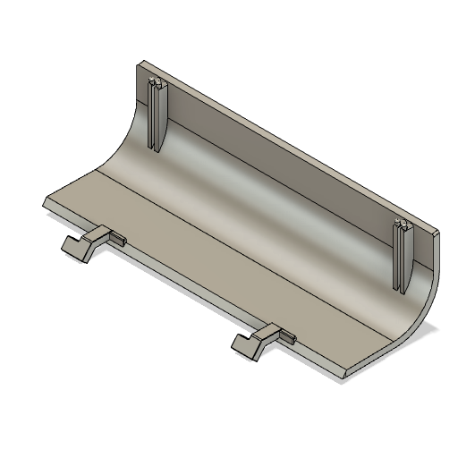
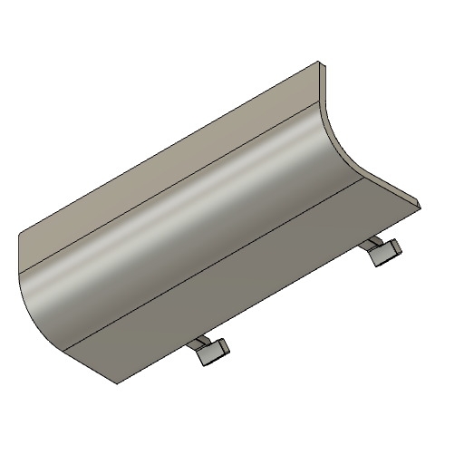
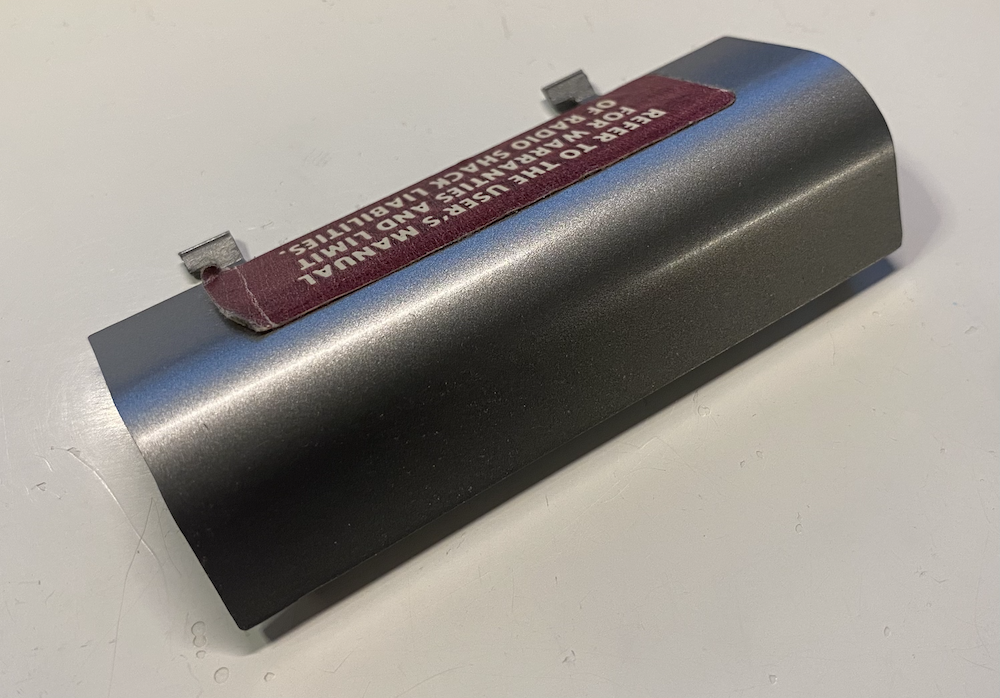
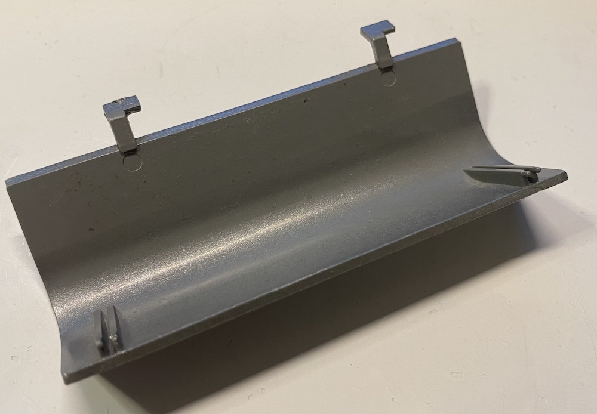

# TRS-80 Model 1 - Main Enclosure Door - 3D Printer

The main enclosure door covers the edge connector of the Model I. Due to its design, the door hinges often broke. Additionally, since they were only hooked in, they were frequently lost over the years as people misplaced them.

## STL

[STL](Main_Enclosure_Door.stl)

## STL (Improved)

The hinges have been reinforced slightly to reduce the likelihood of breaking. As a result, they require a bit of pressure to insert. However, this ensures they no longer fall off easily and get lost.

[STL](Main_Enclosure_Door_Improved.stl)

## Use Cases

